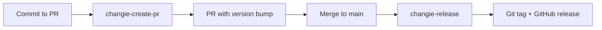

# Changie Release Action

A reusable GitHub Action for creating git tags and GitHub releases after version files have been updated by changie-create-pr.

## Overview

This action is designed to work in a **two-step release workflow**:

1. **changie-create-pr**: Creates a PR with version bumps and changelog updates
2. **changie-release** (this action): When the PR is merged, creates git tag and GitHub release

## Features

- 🏷️ Automatic git tag creation from version files
- 📋 GitHub release with changelog and commit history
- 🔄 Skips if tag already exists
- 📄 Reads version from VERSION file, .version, or CHANGELOG.md
- 🤖 Works with protected branches via bot token

## Workflow



## Usage

### Basic Usage (Recommended)

This is the recommended two-action workflow:

**Step 1: Create PR with version bump** (`.github/workflows/changelog-pr.yml`)

```yaml
name: Create Changelog PR

on:
  pull_request:
    types: [closed]
    branches: [main]

jobs:
  changelog:
    if: github.event.pull_request.merged == true
    runs-on: ubuntu-latest
    steps:
      - uses: actions/checkout@v4
        with:
          token: ${{ secrets.BOT_PAT }}

      - uses: faro-engineering/github-actions/changie-create-pr@v1
```

**Step 2: Create release when PR is merged** (`.github/workflows/release.yml`)

```yaml
name: Create Release

on:
  push:
    branches: [main]
    paths:
      - 'VERSION'
      - 'CHANGELOG.md'

permissions:
  contents: write

jobs:
  release:
    runs-on: ubuntu-latest
    steps:
      - uses: actions/checkout@v4
        with:
          fetch-depth: 0
          token: ${{ secrets.BOT_PAT }}

      - uses: faro-engineering/github-actions/changie-release@v1
        with:
          github-token: ${{ github.token }}
          bot-token: ${{ secrets.BOT_PAT }}
```

### Specify Custom Version File

If your version is stored in a custom location:

```yaml
- uses: faro-engineering/github-actions/changie-release@v1
  with:
    github-token: ${{ github.token }}
    bot-token: ${{ secrets.BOT_PAT }}
    version-file: 'package.json'  # Custom version file location
```

### Custom Release Notes Header

```yaml
- uses: faro-engineering/github-actions/changie-release@v1
  with:
    github-token: ${{ github.token }}
    bot-token: ${{ secrets.BOT_PAT }}
    release-notes-header: '## 🚀 New Release'
```

## Inputs

| Input | Description | Required | Default |
|-------|-------------|----------|---------|
| `github-token` | GitHub token for creating releases | Yes | - |
| `bot-token` | Personal Access Token (PAT) for bot user with bypass permissions to push to protected branches | Yes | - |
| `release-notes-header` | Custom header for release notes | No | - |
| `version-file` | Path to file containing version (e.g., VERSION, .version). If not provided, will extract from CHANGELOG.md | No | - |

## Outputs

| Output | Description |
|--------|-------------|
| `version` | The version that was released |
| `release-url` | URL to the created release |
| `skipped` | Whether the release was skipped (tag already exists) |

## How It Works

### Version Detection

The action reads the version from files in this priority order:

1. **Custom version file** (if `version-file` input is provided)
2. **VERSION** file in repository root
3. **.version** file in repository root
4. **CHANGELOG.md** - extracts first version header

### Tag Creation

- Reads the version from files (created by changie-create-pr)
- Creates an annotated git tag (e.g., `v1.0.0`)
- Pushes the tag to the remote repository
- Skips if tag already exists

### Release Notes

The action generates comprehensive release notes including:

1. **Changelog Section** - Extracted from CHANGELOG.md for this version
2. **Commits Section** - All commits since the previous tag
3. **Footer** - Auto-generated notice

## Changie Integration

This action is designed to work with [Changie](https://changie.dev/) and the `changie-create-pr` action:

1. **changie-create-pr**: Runs `changie batch` and `changie merge` to update VERSION and CHANGELOG.md
2. **changie-release**: Reads the VERSION file and creates the git tag and GitHub release

### Setting up Changie

1. Install Changie:
```bash
go install github.com/miniscruff/changie@latest
```

2. Initialize in your project:
```bash
changie init
```

3. Create change entries as you work:
```bash
changie new
```

4. The `changie-create-pr` action will batch and merge these changes automatically

## Release Notes Format

Release notes include:

1. **Version Header** - Release version or custom header
2. **Changelog Section** - From CHANGELOG.md (if exists)
3. **Commits Section** - All commits since last release
4. **Footer** - Auto-generated notice

Example output:
```markdown
## Release v2

### Changelog

#### Infrastructure
- Updated AWS Identity Center configuration
- Added new permission sets

### Commits

- feat: Add developer groups (John Doe)
- fix: Update permission mappings (Jane Smith)
- docs: Update README (Bot)

---
*Generated by GitHub Actions*
```

## Permissions

The workflow requires these GitHub permissions:

```yaml
permissions:
  contents: write  # To push commits and create releases
```

### Protected Branch Setup

If your main branch has protection rules that prevent direct pushes, you need to configure bypass permissions for your bot user.

#### Step 1: Create a Bot User and PAT

1. **Create or use a GitHub bot account** (e.g., `faro-engineering-bot`)
   - This must be a separate GitHub user account (not an organization)
   - Log in as this bot user

2. **Generate a Personal Access Token (PAT)**
   - Go to Settings → Developer settings → Personal access tokens → Tokens (classic)
   - Click "Generate new token (classic)"
   - Give it a descriptive name (e.g., "Changie Release Bot")
   - Select the `repo` scope (full control of private repositories)
   - Click "Generate token"
   - **Copy the token immediately** (you won't see it again)

3. **Store the PAT as a repository secret**
   - Go to your repository → Settings → Secrets and variables → Actions
   - Click "New repository secret"
   - Name: `BOT_PAT`
   - Value: Paste the PAT you copied
   - Click "Add secret"

**CRITICAL:** The PAT must be generated from the bot user account that you'll add as an admin in Step 3!

#### Step 2: Use the Bot Token in Workflow

```yaml
- uses: actions/checkout@v4
  with:
    fetch-depth: 0
    token: ${{ secrets.BOT_PAT }}  # Use bot PAT for checkout

- uses: faro-engineering/github-actions/changie-release@v1
  with:
    github-token: ${{ github.token }}
    bot-token: ${{ secrets.BOT_PAT }}  # Use bot PAT for pushing
```

#### Step 3: Add Bot as Repository Admin

**THIS IS THE MOST CRITICAL STEP!** The bot user must be a repository admin to bypass branch protection.

1. Go to **Settings → Collaborators and teams**
2. Click **Add people**
3. Search for your bot user account (e.g., `faro-engineering-bot`)
4. Select **Admin** role
5. Click **Add [username] to this repository**

**Verify:** You should see the bot user listed under "Manage access" with "Admin" role.

#### Step 4: Configure Ruleset Bypass (If Using Repository Rulesets)

**Only needed if your error says "Repository rule violations"**

Even though the bot is now an admin, if you're using Repository Rulesets, you may also need to add them to the bypass list:

1. Go to **Settings → Rules → Rulesets**
2. Click on the ruleset that applies to your main branch
3. Scroll down to **Bypass list**
4. Click **Add bypass**
5. Select **Repository role** → Choose **Admin**
6. Click **Save changes**

This allows all users with Admin role (including your bot) to bypass the ruleset.

##### Option B: Branch Protection Rules (Legacy System)

**Use this if you're using the older branch protection system**

1. Go to **Settings → Branches → Branch protection rules**
2. Edit the rule for your main branch
3. Scroll to **Rules applied to everyone including administrators**
4. Enable **Allow force pushes**
5. Click **Specify who can force push**
6. Add your bot user account or a team containing the bot
7. Click **Save changes**

**Important:** If your error says "Repository rule violations", you must use Option A (Rulesets), not Option B.

## Examples

### Example: Complete Two-Action Workflow

**File 1: `.github/workflows/changelog-pr.yml`**

Creates a PR with version bump when PRs are merged to main:

```yaml
name: Create Changelog PR

on:
  pull_request:
    types: [closed]
    branches: [main]

jobs:
  changelog:
    if: github.event.pull_request.merged == true
    runs-on: ubuntu-latest
    steps:
      - uses: actions/checkout@v4
        with:
          token: ${{ secrets.BOT_PAT }}

      - uses: faro-engineering/github-actions/changie-create-pr@v1
```

**File 2: `.github/workflows/release.yml`**

Creates release when VERSION file changes (after changelog PR is merged):

```yaml
name: Create Release

on:
  push:
    branches: [main]
    paths:
      - 'VERSION'
      - 'CHANGELOG.md'

permissions:
  contents: write

jobs:
  release:
    runs-on: ubuntu-latest
    steps:
      - uses: actions/checkout@v4
        with:
          fetch-depth: 0
          token: ${{ secrets.BOT_PAT }}

      - uses: faro-engineering/github-actions/changie-release@v1
        with:
          github-token: ${{ github.token }}
          bot-token: ${{ secrets.BOT_PAT }}
```

### Example: With Deployment Trigger

Automatically deploy after a release is created:

```yaml
name: Release and Deploy

on:
  push:
    branches: [main]
    paths:
      - 'VERSION'

permissions:
  contents: write

jobs:
  release:
    runs-on: ubuntu-latest
    outputs:
      version: ${{ steps.release.outputs.version }}
      skipped: ${{ steps.release.outputs.skipped }}
    steps:
      - uses: actions/checkout@v4
        with:
          fetch-depth: 0
          token: ${{ secrets.BOT_PAT }}

      - id: release
        uses: faro-engineering/github-actions/changie-release@v1
        with:
          github-token: ${{ github.token }}
          bot-token: ${{ secrets.BOT_PAT }}

  deploy:
    needs: release
    if: needs.release.outputs.skipped != 'true'
    uses: ./.github/workflows/deploy.yml
    with:
      version: ${{ needs.release.outputs.version }}
```

### Example: Pulumi Infrastructure Project

For infrastructure projects, you might want to trigger releases on specific file changes:

```yaml
name: Create Release

on:
  push:
    branches: [main]
    paths:
      - 'VERSION'
      - 'CHANGELOG.md'
      - '**.ts'
      - '**.py'
      - '**/Pulumi.*.yaml'

permissions:
  contents: write

jobs:
  release:
    runs-on: ubuntu-latest
    steps:
      - uses: actions/checkout@v4
        with:
          fetch-depth: 0
          token: ${{ secrets.BOT_PAT }}

      - uses: faro-engineering/github-actions/changie-release@v1
        with:
          github-token: ${{ github.token }}
          bot-token: ${{ secrets.BOT_PAT }}
          release-notes-header: '## 🏗️ Infrastructure Release'
```

## Troubleshooting

### Repository Rule Violations Error

**Error:** `remote: error: GH013: Repository rule violations found for refs/heads/main. - Changes must be made through a pull request.`

This error means you're using **Repository Rulesets** and the bot doesn't have bypass permissions.

**Quick Check:** Look at the action logs for the "Configure Git with Bot Credentials" step:
```
👤 Authenticated as: faro-engineering-bot
🔐 Permission level: admin
```

If you see this, your bot is configured correctly. If not:

**If permission is NOT "admin":**
1. The bot user is not a repository admin
2. Go to **Settings → Collaborators and teams**
3. Add the bot user with **Admin** role
4. Wait a few minutes for permissions to sync

**If authenticated user is wrong:**
1. The PAT is from the wrong user account
2. Regenerate the PAT from the correct bot user account
3. Update the `BOT_PAT` secret with the new token

**If both look correct but still failing:**
1. Go to **Settings → Rules → Rulesets**
2. Edit the ruleset for main branch
3. In **Bypass list** → Add **Repository role: Admin**
4. This explicitly allows admin users to bypass the ruleset

### Permission Denied Errors

If you get generic permission errors when pushing:
- Ensure workflow has `contents: write` permission
- Check repository settings → Actions → General → Workflow permissions
- Verify you're using a bot PAT: `bot-token: ${{ secrets.BOT_PAT }}`
- Verify the PAT has the `repo` scope enabled
- Ensure the PAT isn't expired

### Branch Protection Rules Blocking Push

**Error:** Push is rejected but no mention of "repository rule violations"

If you're using the older Branch Protection Rules:
1. Go to **Settings → Branches → Branch protection rules**
2. Enable "Allow force pushes" and add your bot user
3. Or add the bot to a team with bypass permissions
4. See Step 3: Option B above for detailed instructions

### No Commits Found

If the action fails with "unknown revision":
- Ensure `fetch-depth: 0` in checkout action
- The repository needs at least one commit

### Changie Not Found

If Changie commands fail:
- The action will skip changelog generation
- Install Changie locally to create change entries

## License

This action is part of the Soma infrastructure tooling.